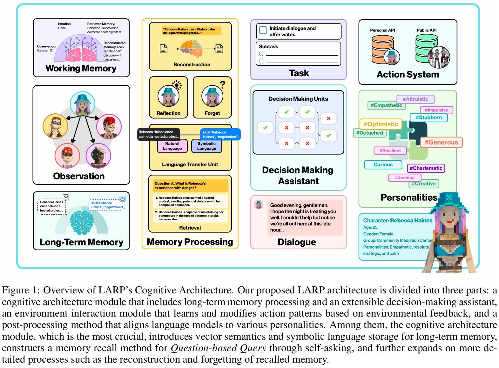

# **LARP: Language-Agent Role Play for open-world games**

[[Website]](https://miao-ai-lab.github.io/LARP/)
[[Arxiv]](https://arxiv.org/submit/5307225)
[[PDF]](https://miao-ai-lab.github.io/LARP/static/LARP.pdf)

________________________________________________

## **Abstract**

Language agents have shown impressive problem-solving skills within defined settings and brief timelines. Yet, with the ever-evolving complexities of open-world simulations, there’s a pressing need for agents that can flexibly adapt to complex environments and consistently maintain a longterm memory to ensure coherent actions. To bridge the gap between language agents and openworld games, we introduce Language Agent for Role-Playing (LARP), which includes a cognitive architecture that encompasses memory processing and a decision-making assistant, an environment interaction module with a feedback-driven learnable action space, and a postprocessing method that promotes the alignment of various personalities. The LARP framework refines interactions between users and agents, predefined with unique backgrounds and personalities, ultimately enhancing the gaming experience in open-world contexts. Furthermore, it highlights the diverse uses of language models in a range of areas such as entertainment, education, and various simulation scenarios.

## **Installation**

## **Getting Started**

## **Paper & Citation**

OUR WORK IS COMING SOON